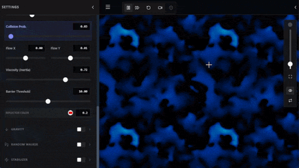

# Reaction-Diffusion VFX Sandbox

<div align="center">

[](https://www.typescriptlang.org/)
[](https://react.dev/)
[](https://vitejs.dev/)
[](https://www.khronos.org/webgl/)
[](https://w3c.github.io/webcodecs/)
[](https://vitest.dev/)
[](LICENSE)

A modular, physics-based visual effects workspace utilizing React and hardware-accelerated WebGL.

[Live Demo](https://rdsandbox.formset.studio) • [Key Features](#key-features) • [Solvers](#simulation-solvers) • [Modulation Matrix](#modulation-matrix) • [Getting Started](#getting-started) • [Testing](#testing)

</div>

---



*Link simulation parameters to LFOs, Step Sequencers, Bézier Keyframes, ADSR Envelopes, Web Audio FFT, or MIDI Controllers.*

---

## Key Features

* **Real-Time WebGL2 Compute:** GPGPU simulation engine running on ping-pong framebuffers with Web Worker and CPU fallback support.
* **25 Generative Solvers:** Reaction-diffusion models, Lattice Boltzmann fluid flow, continuous artificial life (Lenia, Physarum), and cellular automata.
* **Modular Modulation Matrix:** Route signals from LFOs, Step Sequencers, Keyframe timelines, ADSR envelopes, microphone/audio FFT, and Web MIDI to any parameter.
* **Layer Conditioning & Media Ingestion:** Procedural Perlin noise, geometric shapes, typography, mathematical formulas, and live video/webcam inputs with blend modes and Blend-If gating.
* **Offline Video Export:** Hardware-accelerated H.264 MP4 export using browser-native WebCodecs and mp4-muxer.
* **Privacy & Security:** Zero third-party telemetry or external CDN dependencies. Fonts are self-hosted and strict Content Security Policy headers are configured.
* **Accessibility (WCAG 2.1 AA):** Keyboard focus trapping across modal dialogs, accessible forms, and keyboard shortcuts.

---

## Simulation Solvers

| Category | Solvers | Method & Description |
| :--- | :--- | :--- |
| **Reaction-Diffusion** | McRD PDE, Gray-Scott, Belousov-Zhabotinsky (BZ), FitzHugh-Nagumo, Hyper-Dimensional Coupling | Mass-conserving reaction-diffusion PDEs, cubic autocatalytic patterns, excitable chemical waves, and 3-variable cross-diffusion manifolds. |
| **Fluid Dynamics** | Lattice Boltzmann (LBM D2Q9), Lattice Gas Automata (LGA), Curl Turbulence, Vortex Dynamics, Thermal Convection, Surface Tension, Gravity | Discrete Boltzmann distribution models, streamfunction curl velocity fields, thermal buoyancy, and Cahn-Hilliard phase separation. |
| **Artificial Life & Automata** | Lenia Continuous Alife, Physarum Slime Mold, Conway's Game of Life, Second-Order Wave (SoCA), Fractal Automata, Dendritic Crystals, Random Walker | Kernel convolutions with non-linear growth mappings, multi-agent sensory foraging, discrete CA rules, and second-order wave mechanics. |
| **Optics & Dynamics** | Dielectric Plasma Arcs, Quantum Phase Condensate, Chromatic Dispersion, Laplacian Sharpening, Auto-Stabilizer | Dielectric discharge simulations, Gross-Pitaevskii condensates, multi-wavelength refraction, and closed-loop density feedback. |

---

## Modulation Matrix

* **LFO:** Sine, Triangle, Square, Sawtooth, and Perlin Noise waveforms with frequency, phase, and pulse-width controls.
* **Step Sequencer:** 4 to 16 steps with per-step sliders and glide interpolation.
* **Keyframe Timeline:** Multi-node Bézier spline editor with adjustable curve tangents and looping.
* **ADSR Envelope:** Attack, Decay, Sustain, and Release curves with threshold triggering.
* **Audio Input (FFT):** Microphone or audio stream analysis with multi-band frequency tracking and envelope following.
* **MIDI Input:** Direct hardware controller binding for Continuous Controllers (CC) and velocity triggers.

---

## Viewport & Export

* **Infinite Viewport:** Sub-pixel pan and zoom navigation with periodic toroidal boundary wrapping.
* **Surface Shading:** Real-time screen-space normal reconstruction, Blinn-Phong specular highlights, and bump height mapping.
* **Color Grading:** 3-channel RGB mode, procedural scalar gradient palettes, exposure, contrast, gamma, and tint controls.
* **Video Export:** In-browser hardware encoding to H.264 MP4 using WebCodecs with adjustable framerate and speed multipliers.
* **URL State Sharing:** Compressed URL hash serialization using native `CompressionStream` (`deflate-raw`).

---

## Project Structure

```
.
├── components/                 # React UI Components
│   ├── automation/             # Modulation controls (LFO, Sequencer, Keyframes, ADSR, MIDI, Audio)
│   ├── controls/               # Parameter sliders and solver panels
│   ├── layout/                 # TopBar, Sidebars, CanvasUI, QuickAccessBar
│   ├── modals/                 # Accessible modal dialogs
│   ├── seeding/                # Seed editors (Perlin, Shapes, Math, Video, Webcam)
│   └── ui/                     # Shared UI components and buttons
├── context/                    # React Context providers (State, Brush, Viewport, Link)
├── hooks/                      # Core hooks (useSimulation, useRenderer, useMedia, useFocusTrap)
├── presets/                    # Curated presets and default configurations
├── tests/                      # Vitest unit and integration tests (14 suites, 63 tests)
├── types/                      # TypeScript definitions
├── utils/                      # Solvers, GPU shaders, math parser, video recorder
└── workers/                    # Background Web Worker for multi-threaded simulation
```

---

## Getting Started

### Prerequisites
* Node.js v18.0.0 or higher
* npm v9.0.0 or higher

### Installation & Run
```bash
# Clone the repository
git clone https://github.com/glociks/RDSandbox.git
cd RDSandbox

# Install dependencies
npm install

# Start local development server
npm run dev
```

Open [http://localhost:3000](http://localhost:3000) in your browser.

---

## Testing

```bash
# Run test suite
npm run test

# Run TypeScript type checking
npm run typecheck

# Build production bundle
npm run build
```

---

## Controls

| Shortcut / Input | Action |
| :--- | :--- |
| **`Spacebar`** | Play / Pause simulation |
| **`Z`** | Reset simulation to starting seed |
| **`H`** | Toggle UI visibility (Zen mode) |
| **`Escape`** | Close open modal dialogs |
| **`Left Click + Drag`** | Draw on simulation canvas |
| **`Middle Click + Drag`** | Pan viewport |
| **`Mouse Wheel`** | Zoom in / out |

---

## License

Distributed under a custom license. See [LICENSE](LICENSE) for permissions and terms.
